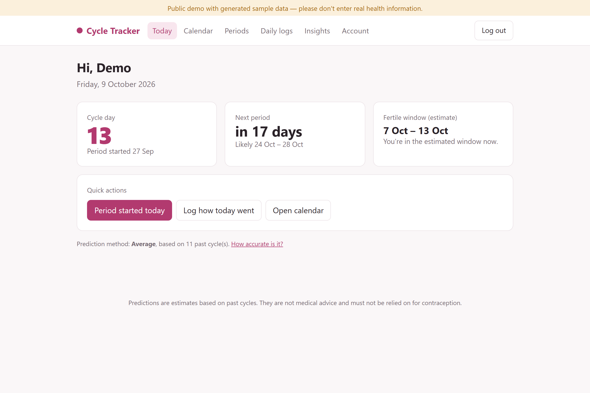
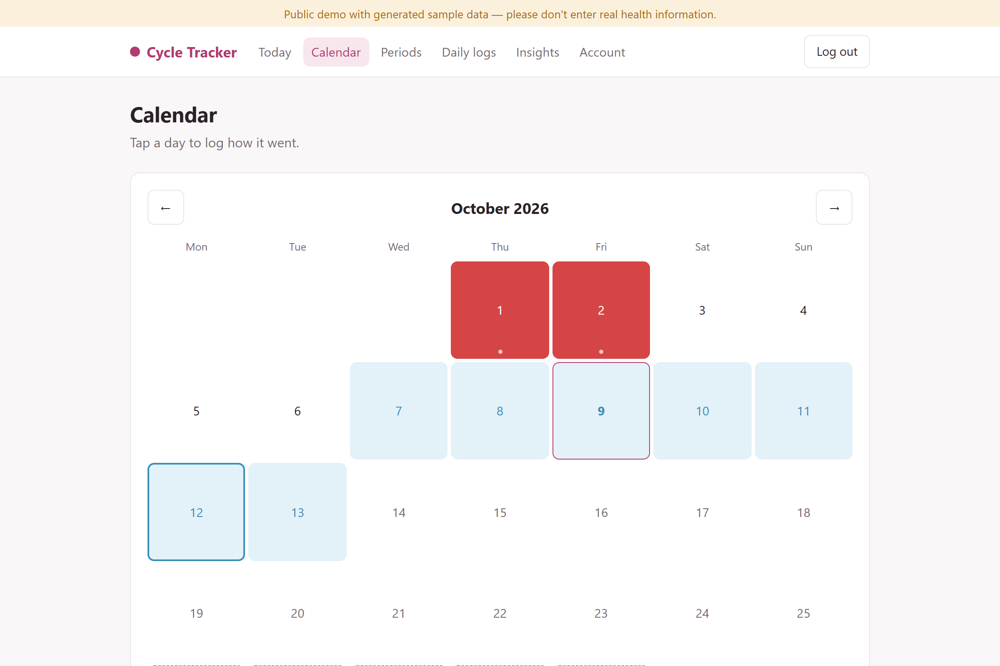
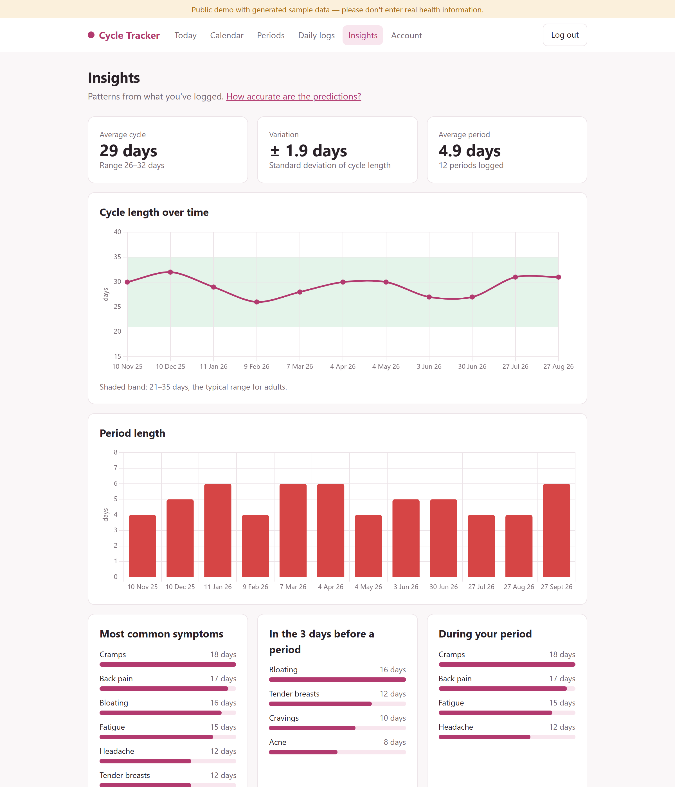
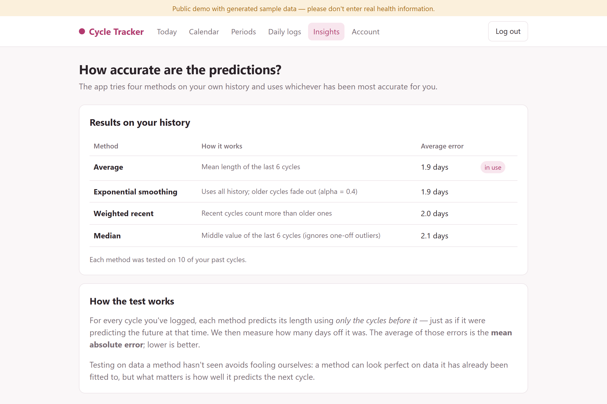
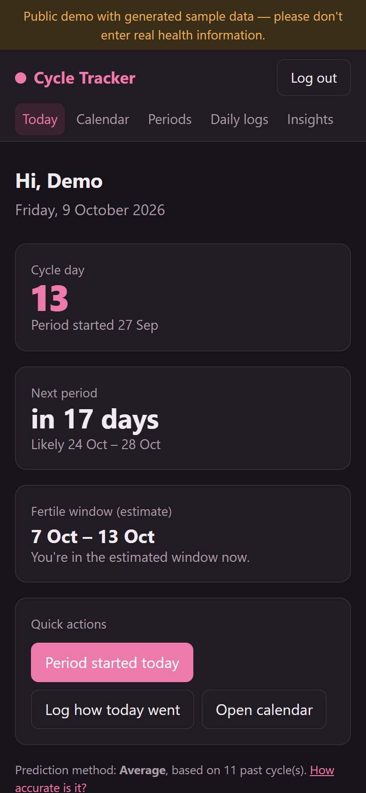

# Cycle Tracker

[](https://github.com/lakshya701/cycle-tracker/actions/workflows/ci.yml)

A private, self-hosted period and cycle tracker built with **Java 21 and Spring Boot**.
Log periods, symptoms and mood; see a calendar with predicted dates; and get insights into
cycle patterns — with predictions that are **tested against the user's own history** and
data that stays private by design.

### 🔗 [Try the live demo](https://cycle-tracker-demo.onrender.com) — click **Open the demo** on the login page

The demo uses generated sample data only. It runs on Render's free plan, so the first visit after a quiet period can take about a minute to wake up.

> ⚠️ Predictions are estimates based on past cycles. They are **not medical advice** and
> **must not be relied on for contraception**.



## Features

- **Logging** — period start/end in one tap, plus daily flow, symptoms, mood and notes
- **Calendar** — logged periods, predicted periods and the estimated fertile window
- **Predictions** — next period as a likely date *range*, with a "late" notice when it's overdue
- **Self-evaluating predictions** — four methods are backtested on the user's history and the most accurate one is used ([how](#how-predictions-work))
- **Insights** — cycle- and period-length charts, symptoms in the days before and during a period, mood patterns
- **Gentle health notes** — suggests talking to a doctor if cycles are repeatedly under 21 or over 35 days, very irregular, or periods last more than 7 days
- **Email reminders** — two days before the predicted start (opt-out in settings)
- **Your data, your control** — CSV export and one-step "delete my account and everything I logged"
- **Installable on a phone** (PWA), responsive layout and automatic dark mode

| Calendar | Insights |
|---|---|
|  |  |

| Prediction accuracy | Phone, dark mode |
|---|---|
|  |  |

## How predictions work

Most period apps average the last few cycles. This one compares four methods and lets the
data decide:

| Method | Idea |
|---|---|
| Average | Mean length of the last 6 cycles |
| Median | Middle of the last 6 — not thrown off by one unusual cycle |
| Weighted recent | Last 6 cycles, newer ones count more (6×, 5×, … 1×) |
| Exponential smoothing | All history, older cycles fade out (α = 0.4) |

**Backtesting.** For every past cycle, each method predicts its length using *only the cycles
before it* — exactly as if it were predicting the future at that point — and we record how many
days off it was. The method with the lowest **mean absolute error (MAE)** is used for the real
prediction, and the comparison is shown to the user on the *Accuracy* page.

Other details:
- The likely range is ± the recent standard deviation of cycle length (between 2 and 7 days).
- Ovulation is estimated 14 days before the next period (the luteal phase is fairly constant);
  the fertile window is the 5 days before ovulation plus ovulation day and the day after.
- Gaps over 60 days are treated as missed logs rather than real cycles.
- With fewer than 4 logged periods there isn't enough history to compare fairly, so the average is used.

The tests check, for example, that the **median wins when history contains one outlier** and that a
**method favouring recent cycles wins when cycles drift steadily longer**
([`PredictionServiceTests`](src/test/java/com/lakshya/cycletracker/prediction/PredictionServiceTests.java)).

## Privacy by design

- Login required; passwords hashed with **BCrypt**
- Every database query is scoped to the logged-in user — asking for someone else's record returns
  **404**, so it doesn't even reveal that the record exists (covered by tests)
- CSRF protection on every form; secure session cookies in production
- The service worker caches only static files (CSS, icons) — pages with personal data are never cached
- One-click CSV export and permanent account deletion
- Credentials come only from environment variables; local database files are git-ignored
- The **public demo** runs on an in-memory database seeded with generated data, shows a warning
  banner and has **sign-up disabled**, so no one's real health data ends up there

## Architecture

```
Browser (Thymeleaf pages, Chart.js, PWA)
        │
Spring MVC controllers ── web/          HTTP, forms, validation
        │
Services ─────────────── prediction/    predictors, backtesting, health notes
        │                reminder/      daily scheduled reminder emails
        │                security/      Spring Security config, current user
        │
Spring Data JPA ──────── domain/        AppUser, Cycle, DailyLog + repositories
        │
PostgreSQL (production) · H2 (local development and demo)
```

Predictors use the **strategy pattern**: each implements `CyclePredictor`, so adding a new
method is one class and it is automatically included in the comparison.

## Tech stack

Java 21 · Spring Boot 4 · Spring MVC · Spring Data JPA · Spring Security · Thymeleaf ·
PostgreSQL / H2 · Chart.js · JUnit 5 + MockMvc · Docker · GitHub Actions · Render

## Run it locally

Requires JDK 21.

```bash
./mvnw spring-boot:run                 # Windows: mvnw.cmd spring-boot:run
```

Open http://localhost:8080 and create an account. Local data is stored in `./data/` (git-ignored).

To try it with sample data instead:

```bash
./mvnw spring-boot:run -Dspring-boot.run.profiles=demo
```

Then click **Open the demo** on the login page.

Run the tests (37 tests: predictors, prediction service, security and ownership, every page
rendering, exports, deletion, reminders and demo mode):

```bash
./mvnw test
```

## Deploy

**Public demo (Render).** [`render.yaml`](render.yaml) deploys the demo as a free Docker web
service using the `demo` profile — no database needed. In Render: *New → Blueprint* → pick this repo.

**Private instance (real use).** Run the Docker image with the `prod` profile and a PostgreSQL database:

| Variable | Example |
|---|---|
| `SPRING_PROFILES_ACTIVE` | `prod` |
| `DATABASE_URL` | `jdbc:postgresql://host:5432/cycles?sslmode=require` |
| `DATABASE_USERNAME` / `DATABASE_PASSWORD` | database credentials |
| `SPRING_MAIL_HOST`, `SPRING_MAIL_PORT`, `SPRING_MAIL_USERNAME`, `SPRING_MAIL_PASSWORD`, `APP_MAIL_FROM` | optional — enables reminder emails |
| `APP_URL` | public URL, used in reminder emails |

CI builds the Docker image and checks that the demo starts on every push.

## Project structure

```
src/main/java/com/lakshya/cycletracker/
  domain/        entities and repositories
  prediction/    CyclePredictor strategies, PredictionService, CycleHistory
  reminder/      ReminderService (scheduled emails)
  security/      SecurityConfig, user lookup
  demo/          generated demo data (demo profile only)
  web/           controllers, forms and services for each page
src/main/resources/
  templates/     Thymeleaf pages
  static/        CSS, icons, PWA manifest and service worker
  application*.properties   local, demo and production config
```
